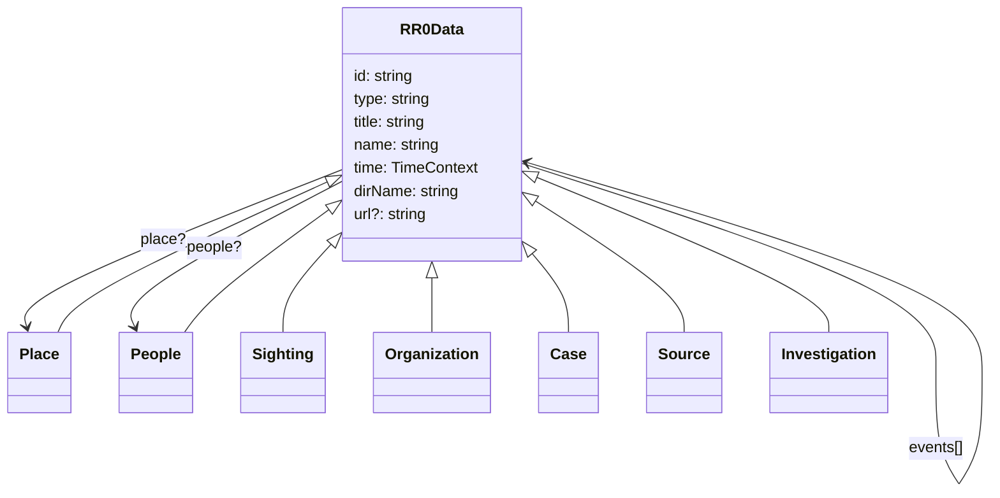

# Data

All RR0 data types share common properties from their `RR0Data` interface.

Also, all RR0Data have other RR0Data types as properties, such as:

- [place](../place/README.md)
- [people](../people/README.md)
- [events[]](../event/README.md)

