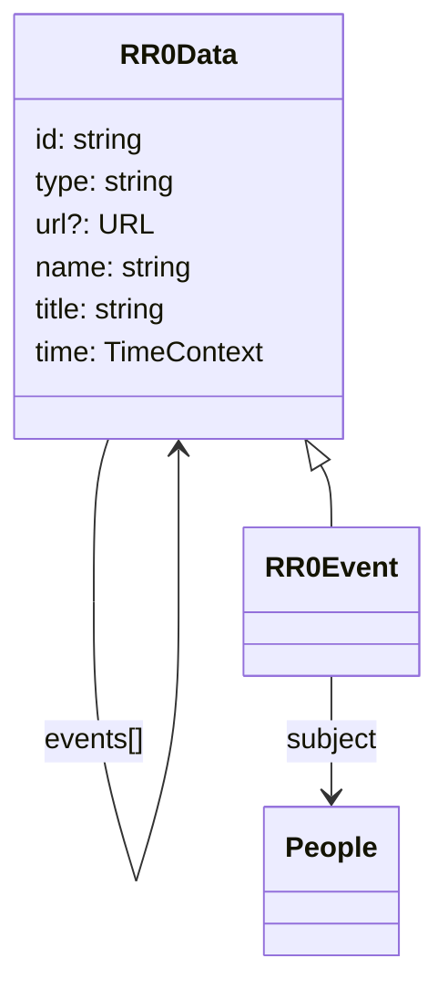

# RR0 Event

A RR0 event is a [RR0 Data](../README.md) with some people as a `subject`
and a `kind` (subtype) which can be:

- `birth`/creation
- `death`/discontinuation
- `image` snapshot
- `book` publication
- `sighting`

